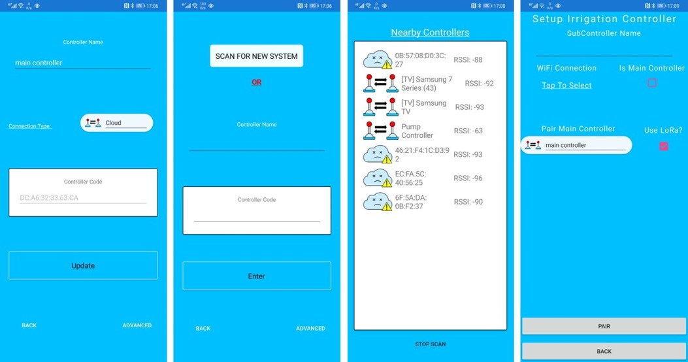

# Smart Farms app

### Status
The first image depicts what the user sees once connected to the controller. It allows the user to view all of the saved controllers as well as the controller's sites and Sub-Controllers and the user has the option to delete them. If a pressure sensor is attached to a site, the site will show its current reading.
#### Sub-Controller
The second image shows the Sub-Controllers screen. A Sub-Controller can also be added using this screen. The user can change the connection details. The controller will try to use the network connection if it's available over LoRa but the user can specify to force the controller to only use LoRa. This screen also shows the Mac Address of the Sub-Controller as well as its communication key. This key cannot be changed as it's set on the pairing process when adding a Sub-Controller. If a Sub-Controller is deleted, all the equipment and schedules of that Sub-Controllers will also be deleted from the "master".
#### Sites
The third image displays the Site screen, the user needs to give the site a name and optionally the description. The screen shows how to add existing equipment (Pumps/Zones/Sensors) to the selected site. Equipment can only be assigned to one site. When the user deletes a site, all the equipment added to that site will be unassigned, and the user can assign them to a new/different site.

### Update Controller
The first image shows the current settings used for that selected controller. The user has the option to change the connection type to **Cloud/BlueTooth/Network/Automatic**. If subscribed to the _"Cloud"_ connection, it connects the mobile application to an online database, allowing the user to view/update the controller without being directly connected. The _"BlueTooth"_ connection allows the user to connect to the controller when they're nearby. If the controller does not have access to a network then the user can still use _BlueTooth_ to communicate with the controller. The _"Network"_ connection allows the user to connect using their local network or access it through the internet by using the provided external IP (Note: port forwarding may be needed). On the advanced page, the internal and external network details can be filled in; the application will use the best connection. The  _"Automatic"_ connection will decide which connection type to use. The user cannot change the connection code as the application uses this code to connect to the controller through _BlueTooth_.

### New Controller
The second image depicts the different ways the user can add a controller. If the controller hasn't been set up yet, the user will use the _"Scan FOR NEW CONTROLLER"_ button; this will start scanning for nearby controllers. If the controller code is known, the user can type the code in; everything else will be done in the background, such as getting the controller's internal and external connection. The advanced page allows the user to enter the internal and external connection manually.

### BlueTooth Scanner
The third image shows the available connections. The default connection name is _"Pump Controler"_. The user will tap on the controller they want to connect to. If this is the first time the device is connecting to that controller, the controller may have to be restarted; the controller will only accept new connections for the first 15 minutes. If the connection was successful and the application has determined that it's a valid controller, the setup screen will appear.

### Setup Irrigation Controller
The fourth image displays the setup screen. If there's no wired network connection, the user will have to select a wifi connection. If the connection was successful, the application will show the internal connection. If the user wants to use the controller as a sub-controller, the _"Is Main Controller"_ box must not be selected. In this case, additional information must be provided; the user needs to specify which irrigation controller to pair to the sub-controller and also has the option to tell the controller to use LoRa for communications.

### Schedule Summary Screen
The first image depicts the screen where the user can see the active schedules, queued schedules, and all the sensor readings on the selected site.

### Manual Schedule Screen
The second image depicts the next navigation screen, which is the manual page. Here users can select pumps and/or zones that they wish to run once-off and set the duration. If they want the current schedules to continue while the manual action is running, they will select "run with the schedule"; otherwise, the active schedule will be overridden. The manual action can also be stopped by selecting "stop". 

### Settings Screen
On the settings screen, the user has the option to view or edit Sites and Equipment.

### Custom Schedule Screen
This image depicts the custom schedule page. The custom schedules can be turned on and off from this screen. It also shows basic information, such as the pump it uses, how many times it needs to be repeated. When a custom schedule is running, it will show the remaining time left otherwise it will show the total running time. When a custom schedule is selected, a detailed description of the custom schedule is presented, as well as the option to edit and delete it (see the second image). If a user wants to start the custom schedule from a specific Zone, the user can tap on that zone. When users select "Create Custom Schedule", the screen on the right appears. The user can then enter the name of the custom schedule, which pump it makes use of and how many time they would like it to repeat. The valves used can be selected by entering the duration next to the appropriate valve; those without a duration will automatically be excluded.

### Schedule Screen
This image depicts the schedule page where users can view all their schedules and turn them on and off. It also shows basic information, such as the days for which it's scheduled and which pump it uses. When a schedule is selected, a detailed description of the schedule is presented to the user, as well as the option to edit and delete it (see the second image). When users select "Create Schedule", the screen on the right appears. The user can then enter the name of the schedule, the starting time, which pump it makes use of, and the day(s) of the week the scheduled item will run. The valves used can be selected by entering the duration next to the appropriate valve; those without a duration will automatically be excluded. If no zones are selected, there will be a pop-up screen warning the user that there have been no zones selected and give them the option to just run the pump for the duration that the user enters.

### Equipment Screen
This screen displays all the pumps, zones and sensors on the currently selected site. If the user edits or deletes any of the equipments, the _"master"_ will communicate this to the equipment's _"Sub-Controller"_ in order to make sure that the action is performed.

### Create Equipment Screen
If the user selects "add equipment", the second image will appear. The user must enter a name, what controller the equipment will be on, and what pin on the controller it will be using (pin 1 - 45).  If the user specifies that they want to add a pump, an extra option is available, namely Direct Online, which the user will select if the pump supports it. 

### Create Sensor Screen
If the user selects "Add Sensor", the third image will appear. The user must enter a name, what controller the equipment will be on, what type of sensor they're adding and what pin on the controller it will be using (pin 1 - 45). Depending on the sensor, a secondary pin will appear and needs to be filled in. If supported the user can attach the sensor to a pump or zone, this is used as a safeguard. once an equipment is selected, extra fields will appear, the user will have to add the "Threshold Low, Threshold High, Threshold Minutes" This is used to monitor the pressure when the equipment is active. if the pressure value is below or above the set thresholds over the set time, the manual/custom/schedule using them will be turned off to prevent any damages.

